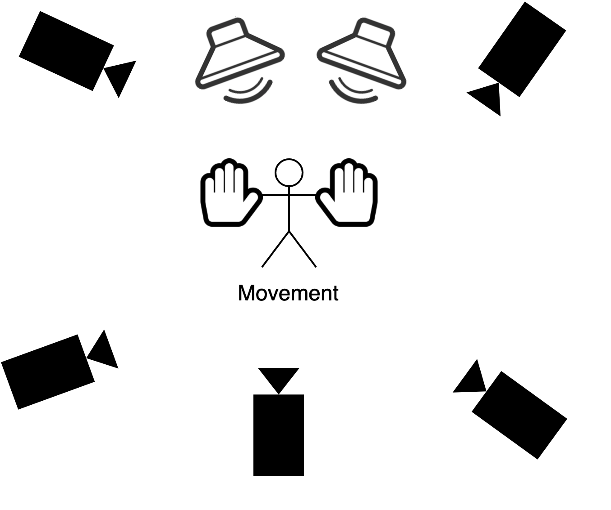
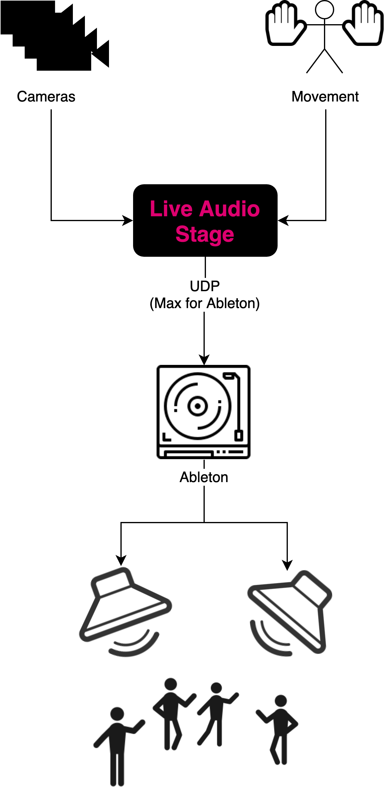

# Live Audio Stage

Live Audio Stage (LAS) is an interactive system that controls an audio composition through the movement of a person. The goal behind the project is to unify Computer Science and Music Theory concepts within one project as part of the Digital Humanities initiative at University of Haifa.

Team members:

- Kamal Nasser
- Asala Zreik
- Yiftah Kadan

Supervisors:

- Dr. Dan Feldman
- Dr. Alon Schab

Mentors:

- Fares Fares

GitHub project: [https://github.com/kamaln7/live-audio-stage](https://github.com/kamaln7/live-audio-stage)

## Demo

<iframe width="560" height="315" src="https://www.youtube.com/embed/EFrwtNCXJdY" frameborder="0" allow="accelerometer; autoplay; encrypted-media; gyroscope; picture-in-picture" allowfullscreen></iframe>

## Overview

---

We use Optitrack, a 3D motion tracking system that tracks objects using cameras in a room. Each hand is fitted with a glove with infrared markers on it. This allows the system to track each hand as a single object.

For the audio, we use Ableton Live as a digital audio workstation. Ableton Live is very flexible and allows us to compose complex music.

Both systems are inherently unrelated. Our main focus is to integrate both platforms. The first stage of our project was to come up with a way to remotely control Ableton and change parameters relating to the music that is being played. Once we completed that step, we needed to map the camera movement to the parameters in Ableton.

To do that, we wrote a program that connects to Optitrack. First, it reads real-time data about the location of both objects (gloves) in the room. After receiving this information from Optitrack, the program uses formulas that we created and tuned and connects to Ableton Live through Max for Live (a scripting platform for Ableton Live) using a plugin that we developed. The plugin receives data from our program and controls specific parameters within Ableton.

The end result is an audio composition that is directly affected and in a way composed by the movement of a person or two in the room like so:

- Our audio composition is split into two "channels" with each hand directly controlling one channel. The height of the hand controls the volume of the related track.
- The distance between both hands controls the tempo of the composition—the farther, the faster. Moving the hands inwards slows it down.
- Finally, we applied a Resonator effect on top of the composition. It is activated in the rear half of the space. The farther the person from the center of the room, the stronger the effect.

## Usage Instructions

1. Open Motive
   1. Run the normal calibration flow using the wand.
   2. Place two gloves with markers in the stage and register each as a rigid body.
   3. For each rigid body, set:
      - Tracing algorithm: Ray-based
      - Smoothing: 40-50
      - Deflection: 30-40
   4. Turn on Data Streaming on the local loopback interface
2. Open Ableton Live
   1. Import the Ableton project. You might need to give Ableton the path to the Max plugin the "Live Audio Stage Control"
3. Open the project in PyCharm
   1. Place the gloves in the center of the room. Start the "Measurement" program and move the glove across the edges of the room in a cuboid shape. This is important so that the program can know the minimum/maximum values. Once done, stop the program and copy the output into `config.py`.
   2. Start the "LAS" program. This will connect to both Motive and Ableton.
4. The 3D center of the room is set as the zero starting point. Have fun!
